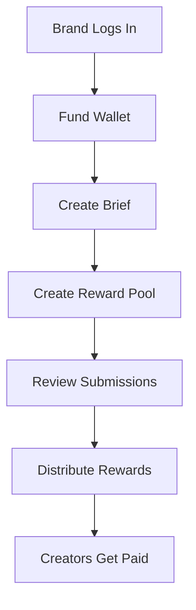
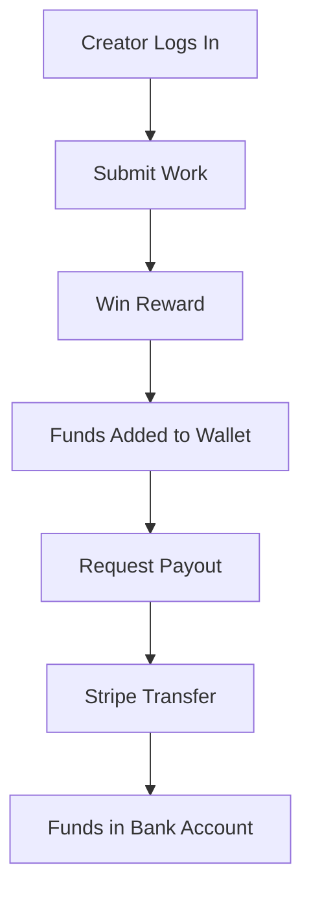

# 🚀 Reward & Payment System Implementation Guide

## 📋 **Overview**

This guide provides step-by-step instructions for implementing the Reward and Payment System with Stripe integration in your DraftBoard platform.

---

## 🛠️ **Prerequisites**

### **1. Environment Setup**
```bash
# Install dependencies
npm install stripe @stripe/stripe-js @stripe/react-stripe-js

# Verify environment variables
echo "Checking environment variables..."
node -e "
console.log('DATABASE_URL:', process.env.DATABASE_URL ? 'SET' : 'MISSING');
console.log('JWT_SECRET:', process.env.JWT_SECRET ? 'SET' : 'MISSING');
console.log('STRIPE_SECRET_KEY:', process.env.STRIPE_SECRET_KEY ? 'SET' : 'MISSING');
console.log('NEXT_PUBLIC_STRIPE_PUBLISHABLE_KEY:', process.env.NEXT_PUBLIC_STRIPE_PUBLISHABLE_KEY ? 'SET' : 'MISSING');
"
```

### **2. Environment Variables**
Add these to your `.env` file:
```env
# Stripe Configuration (Test Mode)
NEXT_PUBLIC_STRIPE_PUBLISHABLE_KEY=pk_test_your_publishable_key_here
STRIPE_SECRET_KEY=sk_test_your_secret_key_here
STRIPE_WEBHOOK_SECRET=whsec_your_webhook_secret

# Payment Settings
MINIMUM_PAYOUT_AMOUNT=10.00
PLATFORM_FEE_PERCENTAGE=2.5
```

---

## 🗄️ **Database Setup**

### **1. Run Database Migrations**
```bash
# Generate and apply migrations
npx prisma migrate dev --name add_reward_payment_system

# Verify schema
npx prisma generate
```

### **2. Verify New Models**
The following models should be added to your database:
- `RewardPool` - Manages reward pools for briefs
- `Transaction` - Tracks all payment transactions
- Updated `Brief` model with `rewardPool` relation

---

## 🔧 **Backend Implementation**

### **1. New API Routes Added**

#### **Payment Routes** (`/api/payments`)
- `POST /create-payment-intent` - Create Stripe payment intent
- `POST /confirm-payment` - Confirm payment and fund wallet
- `GET /wallet/balance` - Get wallet balance and stats
- `GET /wallet/transactions` - Get transaction history
- `POST /payout/request` - Request payout (creators)
- `POST /webhooks/stripe` - Stripe webhook handler

#### **Reward Routes** (`/api/rewards`)
- `POST /create-pool` - Create reward pool for brief
- `POST /distribute/:poolId` - Distribute rewards to creators
- `GET /pool/:briefId` - Get reward pool status
- `GET /brand/pools` - Get brand's reward pools
- `GET /creator/earnings` - Get creator earnings
- `GET /analytics/brand` - Get brand analytics

### **2. Authentication Middleware**
- `server/middleware/auth.js` - JWT token verification
- Supports both brand and creator user types

### **3. Server Integration**
The main server file (`server/index.js`) has been updated to include:
```javascript
// Import new routes
const paymentRoutes = require('./routes/payments');
const rewardRoutes = require('./routes/rewards');

// Add route middleware
app.use('/api/payments', paymentRoutes);
app.use('/api/rewards', rewardRoutes);
```

---

## 🎨 **Frontend Implementation**

### **1. New Components**

#### **PaymentManagement Component**
- **Location**: `src/components/PaymentManagement.tsx`
- **Features**:
  - Wallet balance display
  - Fund wallet with Stripe
  - Request payouts (creators)
  - Transaction history
  - Real-time balance updates

#### **RewardManagement Component**
- **Location**: `src/components/RewardManagement.tsx`
- **Features**:
  - Create reward pools
  - Distribute rewards
  - Analytics dashboard
  - Pool management

### **2. Stripe Integration**
```typescript
// Load Stripe
const stripePromise = loadStripe(process.env.NEXT_PUBLIC_STRIPE_PUBLISHABLE_KEY!);

// Use in components
<Elements stripe={stripePromise}>
  <PaymentForm />
</Elements>
```

### **3. Component Usage**
```typescript
// For brands
<PaymentManagement 
  userType="brand" 
  userId={brandId} 
  token={authToken} 
/>

<RewardManagement 
  userType="brand" 
  userId={brandId} 
  token={authToken} 
/>

// For creators
<PaymentManagement 
  userType="creator" 
  userId={creatorId} 
  token={authToken} 
/>
```

---

## 🧪 **Testing**

### **1. Test Stripe Integration**
```bash
# Test payment intent creation
curl -X POST http://localhost:3001/api/payments/create-payment-intent \
  -H "Authorization: Bearer YOUR_TOKEN" \
  -H "Content-Type: application/json" \
  -d '{"amount": 100}'

# Test webhook (using Stripe CLI)
stripe listen --forward-to localhost:3001/api/payments/webhooks/stripe
```

### **2. Test Cards**
- **Success**: `4242 4242 4242 4242`
- **Decline**: `4000 0000 0000 0002`
- **Insufficient Funds**: `4000 0000 0000 9995`

### **3. Test Scenarios**
1. **Brand funds wallet** → Creates reward pool
2. **Creator wins reward** → Automatic payout
3. **Creator requests withdrawal** → Stripe transfer
4. **Payment failure** → Error handling
5. **Webhook processing** → Status updates

---

## 🔄 **System Flow**

### **1. Brand Flow**


### **2. Creator Flow**


---

## 🔒 **Security Considerations**

### **1. Payment Security**
- All payments processed through Stripe
- PCI compliance handled by Stripe
- Webhook signature verification
- Input validation on all endpoints

### **2. Authentication**
- JWT token verification on all routes
- User type validation (brand vs creator)
- Authorization checks for resource access

### **3. Data Protection**
- Sensitive data encrypted
- Audit logging for all transactions
- Rate limiting on payment endpoints

---

## 📊 **Monitoring & Analytics**

### **1. Key Metrics**
- Payment success rate
- Average transaction value
- Payout processing time
- Error rates
- Revenue tracking

### **2. Logging**
```javascript
// Payment events are logged
console.log('Payment succeeded:', paymentIntent.id);
console.log('Transfer created:', transfer.id);
console.log('Webhook received:', event.type);
```

---

## 🚀 **Deployment**

### **1. Environment Variables**
Ensure all environment variables are set in production:
```env
DATABASE_URL=your_production_database_url
JWT_SECRET=your_production_jwt_secret
STRIPE_SECRET_KEY=your_live_stripe_secret_key
NEXT_PUBLIC_STRIPE_PUBLISHABLE_KEY=your_live_stripe_publishable_key
STRIPE_WEBHOOK_SECRET=your_webhook_secret
```

### **2. Database Migration**
```bash
# Production migration
npx prisma migrate deploy

# Verify connection
npx prisma db push
```

### **3. Webhook Setup**
1. Go to Stripe Dashboard
2. Navigate to Webhooks
3. Add endpoint: `https://yourdomain.com/api/payments/webhooks/stripe`
4. Select events: `payment_intent.succeeded`, `transfer.created`, `transfer.paid`

---

## 🐛 **Troubleshooting**

### **1. Common Issues**

#### **Payment Intent Creation Fails**
```bash
# Check Stripe key
echo $STRIPE_SECRET_KEY

# Test Stripe connection
node -e "
const stripe = require('stripe')('$STRIPE_SECRET_KEY');
stripe.paymentIntents.create({amount: 1000, currency: 'usd'})
  .then(pi => console.log('Success:', pi.id))
  .catch(err => console.error('Error:', err.message));
"
```

#### **Database Connection Issues**
```bash
# Test database connection
npx prisma db push

# Check environment variables
node -e "console.log('DATABASE_URL:', process.env.DATABASE_URL ? 'SET' : 'MISSING');"
```

#### **Webhook Not Receiving Events**
```bash
# Test webhook locally
stripe listen --forward-to localhost:3001/api/payments/webhooks/stripe

# Check webhook secret
echo $STRIPE_WEBHOOK_SECRET
```

### **2. Error Handling**
All endpoints include proper error handling:
- Input validation
- Database error handling
- Stripe error handling
- User-friendly error messages

---

## 📈 **Next Steps**

### **1. Advanced Features**
- Recurring payments
- Subscription models
- Advanced analytics
- Multi-currency support
- Automated payouts

### **2. Integration Points**
- Email notifications
- SMS notifications
- Admin dashboard
- Reporting tools
- Audit trails

### **3. Performance Optimization**
- Database indexing
- Caching strategies
- Rate limiting
- Load balancing

---

## 📞 **Support**

### **1. Documentation**
- [Stripe Documentation](https://stripe.com/docs)
- [Prisma Documentation](https://www.prisma.io/docs)
- [React Stripe Documentation](https://stripe.com/docs/stripe-js/react)

### **2. Testing Tools**
- [Stripe CLI](https://stripe.com/docs/stripe-cli)
- [Stripe Test Cards](https://stripe.com/docs/testing)
- [Webhook Testing](https://stripe.com/docs/webhooks/test)

---

This implementation provides a robust, secure, and scalable reward and payment system integrated with Stripe for professional payment processing. The system supports both brands and creators with comprehensive wallet management, reward distribution, and payout capabilities.
