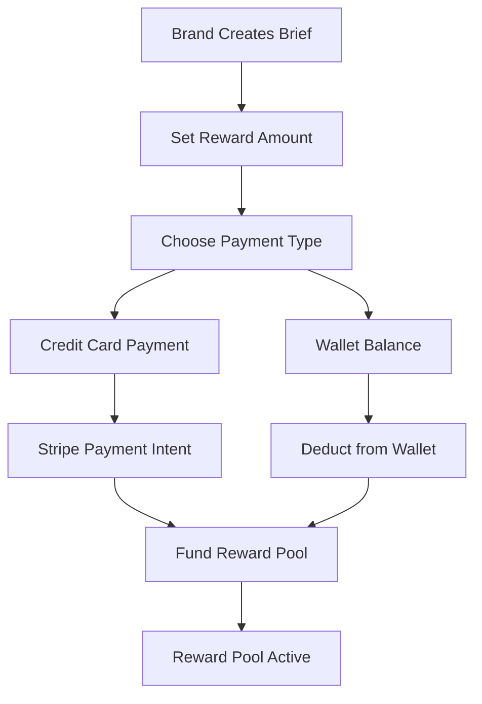
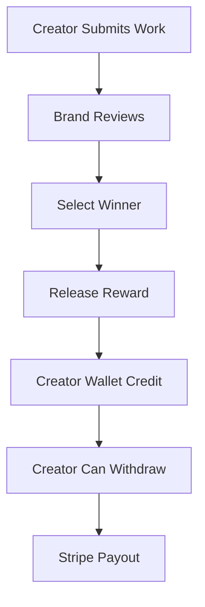
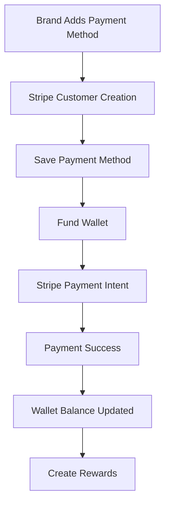
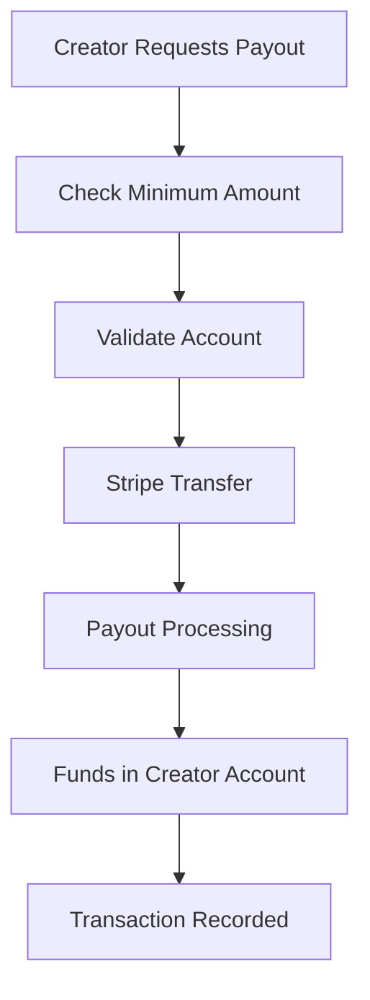

# 🎁 Reward & Payment System Flow with Stripe Integration

## 📋 **System Overview**

This document outlines the complete flow for the Reward System and Payment System, integrated with Stripe for secure payment processing.

---

## 🎯 **Reward System Flow**

### **1. Reward Creation (Brand Side)**


### **2. Reward Distribution (Creator Side)**


---

## 💳 **Payment System Flow**

### **1. Brand Payment Flow**


### **2. Creator Payout Flow**


---

## 🔗 **Integration Points**

### **1. Stripe Integration**
- **Payment Intents**: For brand payments
- **Transfers**: For creator payouts
- **Webhooks**: For payment confirmations
- **Customers**: For recurring payments

### **2. Database Integration**
- **Wallets**: Track balances
- **Transactions**: Record all payments
- **Rewards**: Manage reward pools
- **Payouts**: Track withdrawal history

---

## 🛠️ **Implementation Guide**

### **Phase 1: Core Payment Infrastructure**
1. **Stripe Setup**
   - Configure Stripe keys
   - Set up webhook endpoints
   - Test payment flows

2. **Database Schema**
   - Wallet tables
   - Transaction tables
   - Reward tables

3. **API Endpoints**
   - Payment processing
   - Wallet management
   - Payout requests

### **Phase 2: Reward System**
1. **Reward Creation**
   - Brand funds reward pool
   - Multiple payment methods
   - Reward validation

2. **Reward Distribution**
   - Winner selection
   - Automatic payout
   - Balance updates

### **Phase 3: Advanced Features**
1. **Recurring Payments**
   - Subscription models
   - Auto-funding wallets

2. **Analytics & Reporting**
   - Payment analytics
   - Revenue tracking
   - Payout reports

---

## 🔧 **Technical Implementation**

### **1. Environment Variables**
```env
# Stripe Configuration
NEXT_PUBLIC_STRIPE_PUBLISHABLE_KEY=pk_test_your_publishable_key_here
STRIPE_SECRET_KEY=sk_test_your_secret_key_here
STRIPE_WEBHOOK_SECRET=whsec_your_webhook_secret

# Payment Settings
MINIMUM_PAYOUT_AMOUNT=10.00
PLATFORM_FEE_PERCENTAGE=2.5
```

### **2. Database Schema Updates**
```sql
-- Wallet Tables
CREATE TABLE brand_wallets (
  id SERIAL PRIMARY KEY,
  brand_id VARCHAR(255) REFERENCES brands(id),
  balance DECIMAL(10,2) DEFAULT 0.00,
  created_at TIMESTAMP DEFAULT NOW(),
  updated_at TIMESTAMP DEFAULT NOW()
);

CREATE TABLE creator_wallets (
  id SERIAL PRIMARY KEY,
  creator_id VARCHAR(255) REFERENCES creators(id),
  balance DECIMAL(10,2) DEFAULT 0.00,
  created_at TIMESTAMP DEFAULT NOW(),
  updated_at TIMESTAMP DEFAULT NOW()
);

-- Transaction Tables
CREATE TABLE transactions (
  id SERIAL PRIMARY KEY,
  user_id VARCHAR(255),
  user_type VARCHAR(50), -- 'brand' or 'creator'
  type VARCHAR(50), -- 'deposit', 'withdrawal', 'reward', 'payout'
  amount DECIMAL(10,2),
  stripe_payment_intent_id VARCHAR(255),
  stripe_transfer_id VARCHAR(255),
  status VARCHAR(50), -- 'pending', 'completed', 'failed'
  created_at TIMESTAMP DEFAULT NOW()
);

-- Reward Tables
CREATE TABLE reward_pools (
  id SERIAL PRIMARY KEY,
  brief_id VARCHAR(255) REFERENCES briefs(id),
  total_amount DECIMAL(10,2),
  remaining_amount DECIMAL(10,2),
  status VARCHAR(50), -- 'active', 'distributed', 'cancelled'
  created_at TIMESTAMP DEFAULT NOW()
);
```

### **3. API Endpoints**
```javascript
// Payment Endpoints
POST /api/payments/create-payment-intent
POST /api/payments/confirm-payment
POST /api/payments/fund-wallet

// Wallet Endpoints
GET /api/wallets/balance
GET /api/wallets/transactions
POST /api/wallets/withdraw

// Reward Endpoints
POST /api/rewards/create-pool
POST /api/rewards/distribute
GET /api/rewards/pool-status
```

---

## 🧪 **Testing Strategy**

### **1. Payment Testing**
```bash
# Test Stripe connection
stripe balance retrieve

# Test payment intent
stripe payment_intents create --amount=1000 --currency=usd

# Test webhook events
stripe trigger payment_intent.succeeded
```

### **2. Test Cards**
- **Success**: 4242 4242 4242 4242
- **Decline**: 4000 0000 0000 0002
- **Insufficient Funds**: 4000 0000 0000 9995

### **3. Test Scenarios**
1. **Brand funds wallet** → Creates reward pool
2. **Creator wins reward** → Automatic payout
3. **Creator requests withdrawal** → Stripe transfer
4. **Payment failure** → Error handling
5. **Webhook processing** → Status updates

---

## 🚀 **Deployment Checklist**

### **Pre-Production**
- [ ] Stripe test mode configured
- [ ] Webhook endpoints set up
- [ ] Database migrations run
- [ ] Environment variables set
- [ ] Payment flows tested

### **Production**
- [ ] Switch to Stripe live mode
- [ ] Update webhook URLs
- [ ] Set production environment variables
- [ ] Monitor payment processing
- [ ] Set up error alerts

---

## 📊 **Monitoring & Analytics**

### **Key Metrics**
- Payment success rate
- Average transaction value
- Payout processing time
- Error rates
- Revenue tracking

### **Alerts**
- Failed payments
- Webhook failures
- Low wallet balances
- Payout delays

---

## 🔒 **Security Considerations**

### **1. Payment Security**
- PCI compliance through Stripe
- Secure API endpoints
- Input validation
- Rate limiting

### **2. Data Protection**
- Encrypted sensitive data
- Secure database connections
- Audit logging
- Access controls

### **3. Fraud Prevention**
- Payment verification
- Suspicious activity detection
- Manual review processes
- Dispute handling

---

## 📞 **Support & Maintenance**

### **1. Customer Support**
- Payment issue resolution
- Payout troubleshooting
- Account verification
- Dispute management

### **2. Technical Maintenance**
- Regular security updates
- Performance monitoring
- Database optimization
- API version management

---

This comprehensive flow ensures a robust, secure, and scalable reward and payment system integrated with Stripe for professional payment processing.

